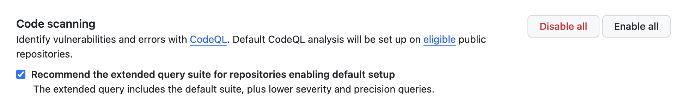
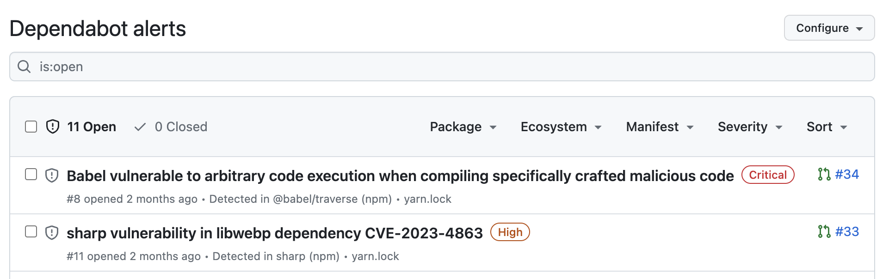

****# Coding Standards

## Prettier and ESLint

To ensure uniform code formatting across BĮIP projects, we leverage [Prettier](https://prettier.io/), and for
identifying and fixing code issues, we rely on [ESLint](https://eslint.org/).

A unified configuration for both Prettier and ESLint is maintained, and detailed instructions can be found
at [biip-shared-configuration](https://github.com/AplinkosMinisterija/biip-shared-configuration).

### Implementation

We employ [Husky](https://github.com/typicode/husky) to set up git hooks
and [lint-staged](https://github.com/lint-staged/lint-staged) to selectively lint only the files intended for commit.

Example `package.json` configuration:

```json
{
  "scripts": {
    "lint": "eslint --ext .js,.ts .",
    "prepare": "husky install"
  },
  "lint-staged": {
    "*.{js,jsx,ts,tsx}": [
      "prettier --write",
      "eslint"
    ],
    "*.{md,html,css}": "prettier --write"
  }
}
```

## CodeQL

To identify vulnerabilities and errors, we utilize CodeQL as a robust static analysis tool. The default setup,
complemented by the extended query suite, works seamlessly. Configuration is easily managed within
the `Code security and analysis` settings, eliminating the need for defining custom CodeQL workflows.



## Dependabot

For streamlined management of dependency security updates, we employ Dependabot.



Custom Dependabot rules are provided for each repository, automating the assignment of reviewers and the initiation of
pull requests exclusively for security updates.

Example Dependabot rules (`.github/dependabot.yml`):

```yaml
version: 2
updates:
  # Maintain dependencies for npm
  - package-ecosystem: npm
    directory: /
    open-pull-requests-limit: 0
    schedule:
      interval: daily
    reviewers:
      - AplinkosMinisterija/biip-developers

  # Maintain dependencies for GitHub actions
  - package-ecosystem: github-actions
    directory: /
    open-pull-requests-limit: 0
    schedule:
      interval: daily
    reviewers:
      - AplinkosMinisterija/biip-devops

  # Maintain dependencies for Docker
  - package-ecosystem: docker
    directory: /
    open-pull-requests-limit: 0
    schedule:
      interval: daily
    reviewers:
      - AplinkosMinisterija/biip-devops
```

